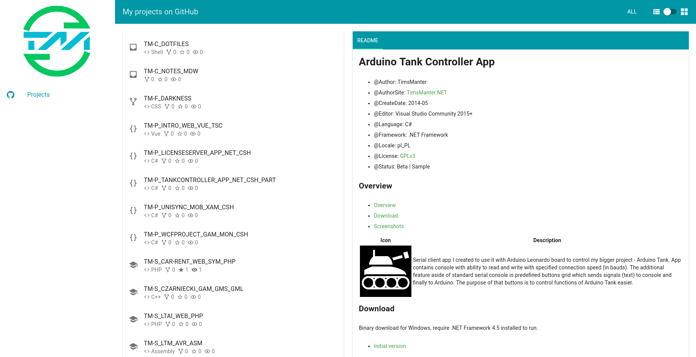
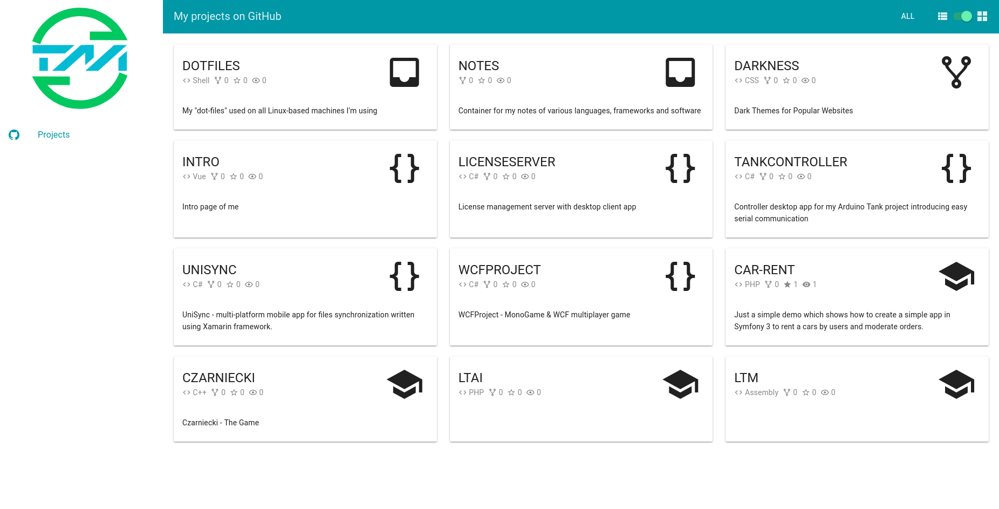
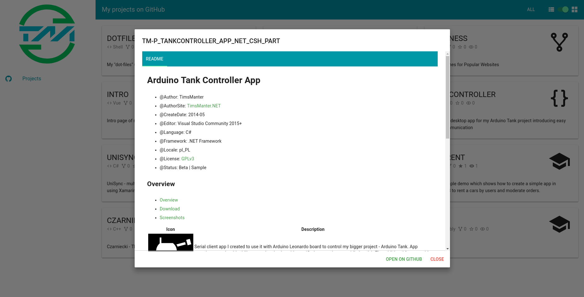

# Intro site with introduce of me

<!-- TOC -->

- [Overview](#overview)
- [Screenshots](#screenshots)

<!-- /TOC -->

## Overview

Written using Vue.js with a taste of TypeScript bindings and Vue Class Component (Vue files). My simple intro site where I keep focus on overviewing myself. At this time only `Projects` page is available but I'm planning to add more general informations as well as move my actual blog site ([TimsManter.NET](http://timsmanter.net/)) to keep it simple.

## Screenshots

